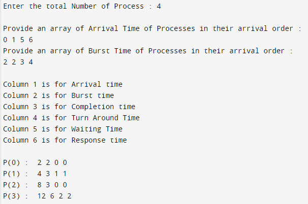

# First Come First Serve (FCFS) CPU Scheduling Algorithm

## Overview
- **Definition:** FCFS is the simplest CPU scheduling algorithm that schedules tasks in the order they arrive in the ready queue.
- **Type:** Non-preemptive.
- **Queue:** Uses a FIFO (First-In-First-Out) queue.

## Characteristics
- **Simple Implementation:** Easy to understand and implement.
- **Non-preemptive:** Once a process starts its execution, it cannot be interrupted until it completes.
- **Fairness:** Each process gets a chance to run in the order of their arrival.

## Advantages
- **Simplicity:** Easy to implement and manage.
- **Predictable:** The order of execution is clear and predictable.
- **No Starvation:** Every process will eventually be executed.

## Disadvantages
- **Inefficiency for Short Tasks:** Can lead to the convoy effect where short tasks are delayed by long tasks.
- **High Average Waiting Time:** May result in a higher average waiting time compared to other algorithms.
- **Poor Performance with Heavy Loads:** Performance can degrade significantly under heavy loads.

## Performance Metrics
1. **Average Waiting Time:** Can be high as processes wait for preceding processes to complete.
2. **Average Turnaround Time:** The total time from process submission to completion.
3. **Throughput:** Number of processes completed per unit time.

## Definitions of Key Performance Metrics

### 1. Arrival Time (AT)
- **Definition:** The time at which a process arrives in the ready queue and is ready to execute.

### 2. Burst Time (BT)
- **Definition:** The total time required by a process for its execution on the CPU.

### 3. Completion Time (CT)
- **Definition:** The time at which a process completes its execution.

### 4. Turnaround Time (TAT)
- **Definition:** The total time taken by a process from arrival to completion.
- **Formula:** `TAT = CT - AT`

### 5. Waiting Time (WT)
- **Definition:** The total time a process spends in the ready queue waiting to be executed.
- **Formula:** `WT = TAT - BT`

### 6. Response Time (RT)
- **Definition:** The time from the arrival of a process to the first time it is scheduled on the CPU.
- **Formula:** `RT = Start Time - AT` (for non-preemptive algorithms, this is often the same as WT)

### 7. Average Waiting Time (AWT)
- **Definition:** The average of the waiting times of all processes.
- **Formula:** `AWT = (∑WT) / n`, where `n` is the number of processes.

### 8. Average Turnaround Time (ATT)
- **Definition:** The average of the turnaround times of all processes.
- **Formula:** `ATT = (∑TAT) / n`, where `n` is the number of processes.

### 9. Throughput
- **Definition:** The number of processes completed per unit time.
- **Formula:** `Throughput = n / Total Time`, where `n` is the number of processes.

### 10. Gantt Chart
- **Definition:** A visual representation of the schedule of processes on the CPU over time, showing the start and end times of each process.

## Use Cases
- Suitable for simple batch systems.
- Environments where the simplicity of the scheduling algorithm is a priority over performance.
- Real-time systems where process execution order is strictly according to arrival time.

## Example

